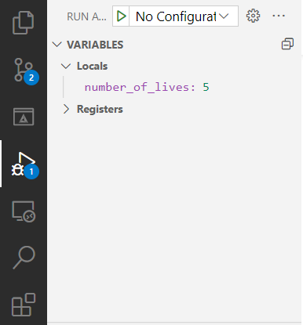
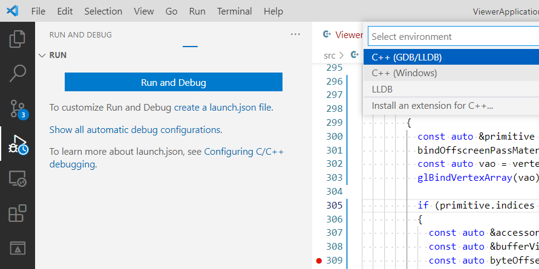

import VSCodeExtension from "@site/components/VSCodeExtension"

## Brief

Are you tired of printing values to the terminal to know what is going on? Is your program crashing and you don't know where or why? Well the debugger has got your back!

A debugger allows you to stop the execution of your program once it reaches a specific point, called a **breakpoint**, or once a crash occurs. Once hit, you are able to inspect the value of all the variables (and the whole program memory). You can also see which functions were called until this point through the **callstack**. Finally, you will be able to advance step-by-step into the execution.

## How to (with VSCode)

### Prerequisites

You need to use <VSCodeExtension id="ms-vscode.cpptools-extension-pack"/> and have a C++ compiler installed on your computer.

### Run your debugger

Simply use the "Run and Debug" button in the bottom bar:

### Set breakpoints

You can set a breakpoint by clicking on the left of the line, right before the line number, or by pressing `F9`.

Then, when you run your code with the debugger the program will pause when it hits a breakpoint and the editor will jump to the breakpoint which was hit. You can even place conditional breakpoints if you right-click on the red dot and select "Edit Breakpoint...". Great if you want the execution to stop only if a variable has a specific value.

### Inspect the state of your program

Once your program paused on a breakpoint or a crash you can see the value of all variables (by hovering over them or looking in the variables window):

You can also see all the functions that have been called previously (called the call stack) and jump to them:

Finally you can execute the program step by step with the second arrow (*step over*) or the third one (*step into*):

### Configure your debugger

If you are using the [template project](https://github.com/JulesFouchy/Simple-Cpp-Setup) this is already done for you! And if you are using the <VSCodeExtension id="ms-vscode.cmake-tools"/> extension you don't even need this `launch.json` config file.

Yet you might want to set this up by yourself in the future. In order to do so, simply open the "Run and Debug" panel and click on the "Run and Debug" blue button. You now have to select your debugger, first option is for Linux, second is for Windows. Press *Default Configuration* and it will create a `launch.json` file under the `.vscode` folder.

If you want to know the specific details, [doc is here](https://code.visualstudio.com/docs/cpp/launch-json-reference). For now you only have to set the `"program"` field with the path to your executable (so you have to build your program with `F7` beforehand). In general with the CMake setup it will be under `${workspaceFolder}/build/bin/Debug/YOURPROGRAM.exe` but you should check to be sure.