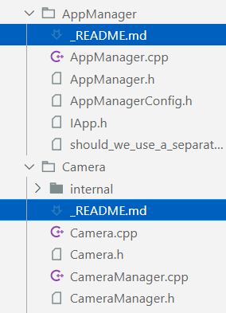

import GoingFurther from "@site/components/GoingFurther"

## Brief

Documenting is an essential part of building a big project. Without it your library would be very hard to use, and your code very hard to understand and maintain.<br/>
You don't necessarily need to do all the things I will advise here, but the more the better. The most important thing is to have a little description of each function / type and how to use them. This is something that you should do as you write your code because if you don't you are never gonna come back to do it later.

Once you have more time and are serious about creating a great library that will be used by many, take the time to write tutorials and examples too.

## Inline documentation

Each function and type should have a little description if there is anything special that the users need to know:

```cpp
/// Returns a random int between min (included) and max (included)
int rand(int min, int max);
```
*Here it is great to indicate whether the min and max bounds are included or excluded.*

I am not a fan of "automatic" documentation where you feel the need to add a description to every parameter. Only do it if you have something meaningful to say about that parameter! Otherwise I much prefer a simple sentence that explains the function and its parameters all at once.

```cpp title="Bad, this is very redondant"
/**
 * @brief Computes the average of a and b.
 * 
 * @param a The first number that you are gonna take the average of.
 * @param b The second number that you are gonna take the average of.
 * @return float The average of a and b.
 */
float average(float a, float b);
```

```cpp title="Good, much easier to read"
/**
 * @brief Computes the average of a and b.
 */
float average(float a, float b);
```

```cpp title="Even better. In that case I don't think the documentation was adding anything that the name didn't already explain"
float average(float a, float b);
```

```cpp title="Very good too. Here we are adding some information that might be interesting to the user"
/// Computes the average of a and b.
/// The order of the parameters doesn't matter (i.e. average(10, 5) == average(5, 10)).
float average(float a, float b);
```

Giving examples is the best way of making the usage of your function clear! Sometimes it can replace a long sentence very effectively. Ideally the example code should be compilable as-is, with no hidden includes. It also allows you to write some script that grabs all your examples and tries to run them. This way you can reuse your examples as tests for your code, and also make sure your examples are always accurate!

## Tutorials and examples

Having a description of each small element is not enough! You also need to show the bigger picture to your users to help them discover and understand the library. Here is an example of a [great tutorial from the Lager library](https://sinusoid.es/lager/architecture.html).

## Using Doxygen

Doxygen is *the* reference tool for C++ projects that want to generate a website from their inline documentation. It has one drawback though: the sites it generates are ugly. You can get around that by using another tool to complement Doxygen, like Sphinx: [here is a nice tutorial](https://devblogs.microsoft.com/cppblog/clear-functional-c-documentation-with-sphinx-breathe-doxygen-cmake/).

## Internal documentation for the maintainers of the library

This kind of documentation is very different from documenting your API. It talks to developpers who will read and modify the internal code. It aims to help them understand the architecture, the reasons the code looks the way it does, and how to change it.

:::tip
Tell a story in your documentation: how do the different components work together?
:::

Once you finish implementing a piece of code you should explain your intentions, the alternatives you considered and the reasons that made you choose this particular implementation. Don't be shy, talk a lot, and leave a trace for others.

<br/>
*__Here is how I like to do it__: Each folder corresponds to a module of the library and has its own ReadMe that explains everything about that module. You can read such a ReadMe [here](https://github.com/CoolLibs/Cool/blob/main/src/Cool/AppManager/_README.md)*.

This is great to make sure people understand why the code is the way it is, don't reintroduce bugs you already fixed, *etc.*<br/>
Even if you are unsure or not confident about your design, say it! It will help future developers have no remorse rewriting your code and be confident there isn't some important thing they are missing and that made you write the code the way you did.

## Going further

<GoingFurther resources = {[
    {
        title: "Documentation in the Era of Concepts and Ranges",
        author: "Christopher Di Bella & Sy Brand",
        link: "https://youtu.be/nm45t2fnUms",
        duration: "1h",
        description: "Good advice on what to put in your documentation"
    },
    {
        title: "Literate Programming in the Large",
        author: "Timothy Daly",
        link: "https://youtu.be/AVyGtu2R0w0",
        duration: "40min",
        description: "About internal documentation"
    },
]}/>