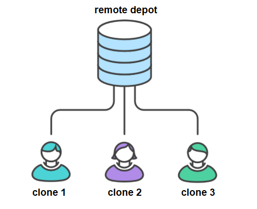
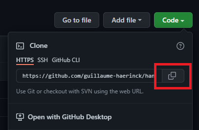
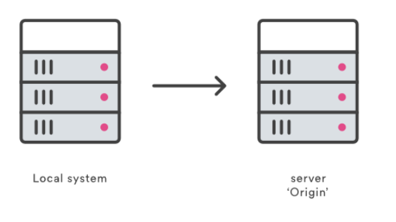

## Brief

*git* is probably the most important tool of all in your programmer's toolbelt! It is a software which is able to handle giant history of all the changes you ever made to your code. It is very powerful to work with other developers and split your tasks.

There are many other software versioning solutions out there, but git remains the most popular.

## Why bother ?

There are a few reasons to learn how to use *git* :

- **revert** : Go back in time if something is broken, to a working state.
- **checkout** : Check how the project was at a given date.
- **commit** : Be able to work step-by-step by grouping your changes with a description.
- **blame** : Be able to know when a line of code was added, and by whom.
- **push** : Have a copy of your code in a server so that other developers can get it.
- **pull** : Get changes made by other developers.

## The big idea

The usual setup when you use git is to create a *remote depot* that is used as a central authority (often this is [github](https://github.com/), but many other providers exist). Authorized developers *clone* the content on their computer, make modifications and *push* their changes back to the depot so that everyone can get it.

It is also possible to work only locally (which is great for a simple test project or TPs). Simply open a command line and type `git init` and you can skip the "inital setup" from the next section. It is still possible afterwards to publish your local repository to github though.

## Step by step

:::tip
These steps are presented with the command line so that you get a better understanding of git. Yet I strongly recommend that you use a software to abstract this for you. You check the next section for an example.
:::

### Initial setup

You first need to install [git](https://git-scm.com/) and go through the setup. Then you can go to [github](https://github.com/), create a new account, and create a new repository (should be a green button on the "Repositories" left panel). Once created, you will be able to clone it in your computer. 

To do so, open a command line in the folder you want you repository to be, and run `git clone your_repo_address`. Replace "your_repo_address" with the one given by github, when you click on the "code" green button.

### Work routine

There are only an handful of commands that are useful on a day-to-day basis, this is how it works :

After making some changes, you have to select the file that you wish to commit to the remote repo. To select all changed file run `git add .`

When you are happy with your changes, you can save them in a group that will be storred locally. To do so run `git commit -m "Place a message about your changes here"`.

Then it is time to make you local commit accessible to others via the remote repository. Simply run `git push`.

In order to get the latest changes from the remote repository, it is recommended to run frequently `git pull` (in particular, always before calling git push). If you work with other developers, it is possible that you encounter conflict if you made changes in the same place in the same files. In this case, check the next section about resolving conflicts.

You might also have heard about branches. This is an advanced git feature, you likely not need to use it for your student projects. If you are curious, you can check the [advanced git features](/lessons/advanced-git-features) lesson.

## Relying on 3rd party software

There are a lot of softwares to make the previous steps easier to handle. I would recommend [gitkraken](https://www.gitkraken.com/) for the job. It is free to use for public repositories, has a nice interface and great set of features. They also have a youtube channel with tons of go-to-the-point [tutorials](https://www.youtube.com/watch?v=v4g6y_HsgpA&list=PLe6EXFvnTV7-_41SpakZoTIYCgX4aMTdU) to get started.

## Handling conflicts

A conflict happen when you made changes in the same place as another developer, but his changes are more recents. In this case, you will have to use an external tool to compare the changes and merge them into a valid file. 

Gitkraken his a great tool to handle these situations, check [this tutorial](https://www.gitkraken.com/learn/git/tutorials/how-to-resolve-merge-conflict-in-git) to get started.

## Good practices

As soon as you have made meaningful progress and the code compiles, make a commit!

Try to avoid putting *unrelated* changes in the same commit.