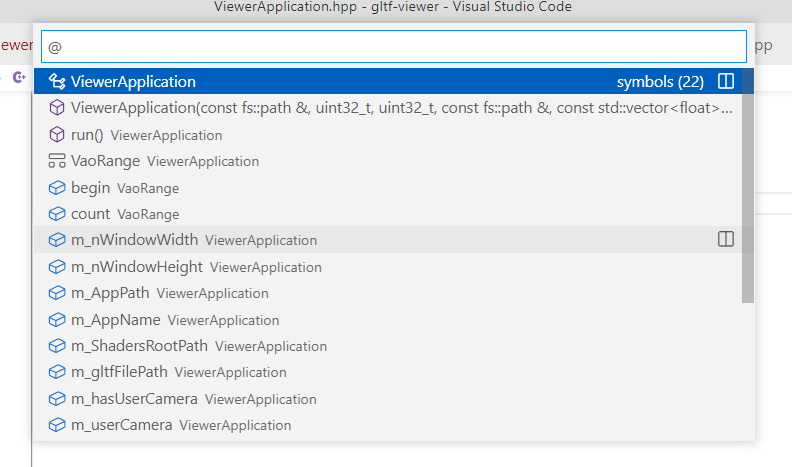
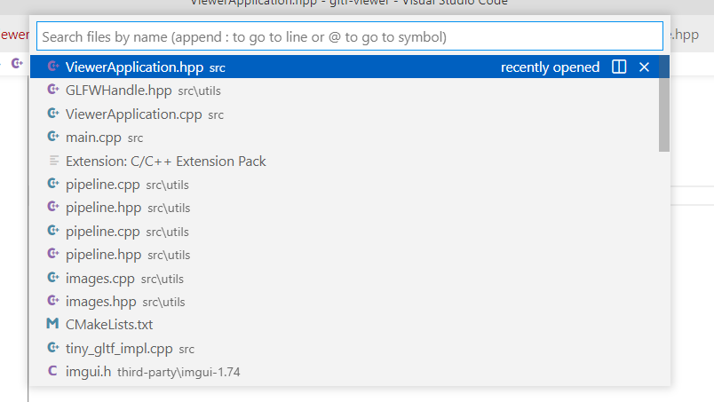
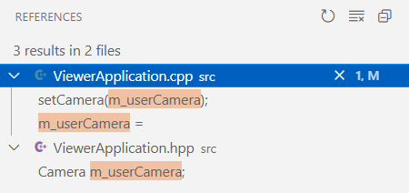
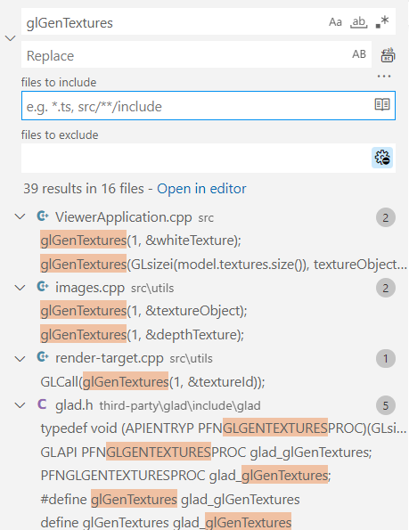

import VSCodeExtension from "@site/components/VSCodeExtension"
import LessonLink from "@site/components/LessonLink"

## Brief

An IDE (Integrated Development Environment) is like a text editor, but way more powerful! It has a lot of additional features that will help you write, run and debug your code!

I personally use and recommend [*Visual Studio Code*](https://code.visualstudio.com/) (*VSCode* for short).

## Extensions

There are many extensions that can help you! Check out the recommended extensions for your language or discover what other people use.

Here are some great extensions for VSCode that I recommend:

- <VSCodeExtension id="ms-vscode.cpptools-extension-pack"/>: The Basic C++ extensions
- <VSCodeExtension id="streetsidesoftware.code-spell-checker"/>: A great spell checker.
- <VSCodeExtension id="yzhang.markdown-all-in-one"/>: To preview your markdown and get help during edition (e.g. it can automatically generate a table of content).
- <VSCodeExtension id="emmanuelbeziat.vscode-great-icons"/>: Nice icons for many file types (.cpp, .hpp, CMakeLists.txt, etc.).
- <VSCodeExtension id="ms-vsliveshare.vsliveshare"/>: This allows you to work remotely with your teammates in one single editor. It is amazing to work together!
- <VSCodeExtension id="Shan.code-settings-sync"/>: Allows you to backup and synchronize your VSCode settings between different computers.
- <VSCodeExtension id="josetr.cmake-language-support-vscode"/>: To provide autocompletion and formatting for CMake.

## Quick actions

Below are a few of the most important things that an IDE will help you with; I will demonstrate them using *VSCode* but rest assured that any other IDE will have the same functionalities. Please note that most of these actions are only available if <VSCodeExtension id="ms-vscode.cpptools-extension-pack"/> is installed in your VSCode.

### Rename

Right-click on any name and choose *Rename Symbol* (or put your text cursor on a name and use the shortcut <kbd>F2</kbd>). 
It is better than doing a "Find and Replace" because "Rename Symbol" is content-aware; e.g. if you rename a class called "Point" it will not affect another class called "Point2D".

### Go to definition

This will take you directly to the definition of the variable / function / class. This is the functionality I use the most to move around my code. 
And if you want to stay focused on the portion of code you are currently editing you can also *Peek* at the definition and it will open a small window inside your current file.

### Go to symbol

This allows you to quickly jump to a method in a file; the shortcut is <kbd>CTRL</kbd> + <kbd>SHIFT</kbd> + <kbd>O</kbd> and then you can type in what you are looking for. It is also super useful to outline the structure of a file.

### Go to file

If you know which file you want to open it is blazing fast to press <kbd>CTRL</kbd> + <kbd>P</kbd> and type what you need.

### Switch between .h and .cpp

Use <kbd>ALT</kbd> + <kbd>O</kbd> to quickly switch between the header and the implementation file. Very useful when you are writing code for a class.

### Find all references

This allows you to find all the places where a symbol is used. Simply right-click on a variable or method and select *Find All References* to get this panel to open. Just like the *Rename Symbol* action it is context-aware and is supposed to only return the correct variable (if another one has the same name, it won't show up).

### Search for a word in the current file

Useful to find you way around, simply press <kbd>CTRL</kbd> + <kbd>F</kbd> to open this popup and search what you need. The arrow on the left allows you to rename the occurrences you found, which can be useful.

### Search for a word in the whole project

If you need to find something fast and easy, run <kbd>CTRL</kbd> + <kbd>SHIFT</kbd> + <kbd>F</kbd>, enter the object of desire and press enter. The VSCode search bar is awesome and won't let you down, you can even batch-rename things there! As a side note, it is also great to be able to limit the search to a specific folder, the option is available when you press the three dots on the right.

### Launching the project

Once you have the <LessonLink slug="cmake" text="CMake"/> setup done (either by using the [template project](https://github.com/JulesFouchy/Simple-Cpp-Setup) or by doing it yourself) you can build the project by pressing <kbd>F7</kbd> or run it using <kbd>CTRL + F5</kbd>.

## Going further

TODO link to lesson Master your IDE