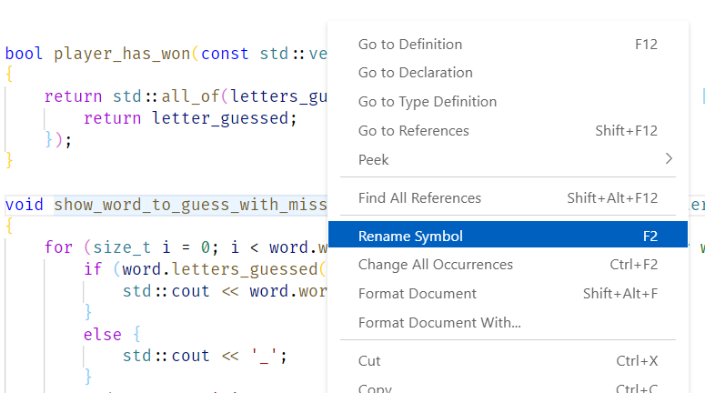
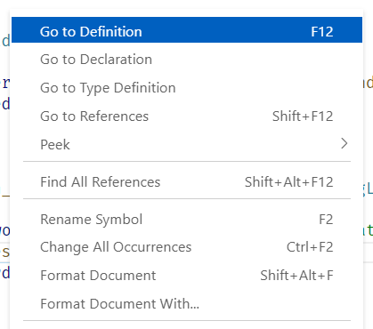

import VSCodeExtension from "@site/components/VSCodeExtension"

## Brief

An IDE (Integrated Development Environment) is like a text editor, but way more powerful! It has a lot of additional functionalities that will help you write, run and debug your code!

I personally use and recommend [*Visual Studio Code*](https://code.visualstudio.com/) (*VS Code* for short).

## Extensions

There are many extensions that can help you! Check out the recommended extensions for your language or discover what other people use.

Here are some great extensions for VS Code that I recommend:

- <VSCodeExtension id="ms-vscode.cpptools-extension-pack"/>: The Basic C++ extensions
- <VSCodeExtension id="coenraads.bracket-pair-colorizer-2"/>: This colors matching pairs of brackets; it makes code more readable
- <VSCodeExtension id="ms-vsliveshare.vsliveshare"/>: Allows you to code remotely on someone else's computer. Is it amazing to work together!

## Quick actions

Below are a few of the most important things that an IDE will help you with; I will demonstrate them with *VS Code* but rest assured that any other IDE will have the same functionalities.

### Rename

Right-click on any name and choose `Rename Symbol` (or put your text cursor on a name and use the shortcut `F2`). 
It is better than doing a "Find and Replace", because "Rename Symbol" is content-aware; e.g. if you rename "Point" to something else it will not affect "Point2D" or a comment where you wrote "Point".

### Go to definition

This will take you directly to the definition of the variable / function / class. This is the functionality I use the most to move around my code.

### Find all occurences

### Search for a word in the current file

### Search for a word in the whole project

### Launching the project

### Putting multiple cursors at once