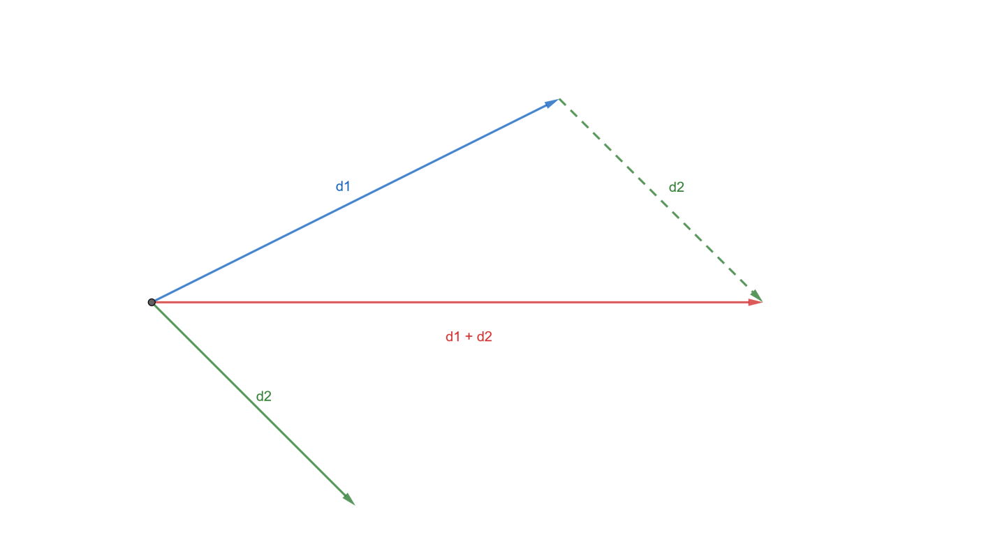

import GoingFurther from "@site/components/GoingFurther"

> [I.4: Make interfaces precisely and strongly typed.](https://isocpp.github.io/CppCoreGuidelines/CppCoreGuidelines#i4-make-interfaces-precisely-and-strongly-typed)

## Brief

*Strong typing* is when you create a type just to wrap an `int`,  so that you can give that `int` a name, invariants, and so on. It helps you express your intent more clearly and makes your APIs harder to misuse. They are amazing and definitely worth the extra little time needed to write them down!

:::tip
*Strong typedefs* (as well as a few other amazing features) are available in the great [*type_safe*](https://github.com/foonathan/type_safe) library. You should consider using it if you want to use strong types. 
[Read this article](https://www.foonathan.net/2016/10/strong-typedefs/) about the *strong typedefs* available in the library.
:::

## Details

[**Read this great article about strong types**](https://www.fluentcpp.com/2016/12/08/strong-types-for-strong-interfaces/).

**And then look at [this great example](https://youtu.be/ojZbFIQSdl8?t=1444) of how using strong types can prevent nasty bugs.**

Once you are done with these, I want to give an example of my own:

Consider a 2D position (a.k.a a point) and a 2D displacement (a.k.a. a vector). They can both be represented with two numbers *x* and *y* even though they are **_very different concepts_**!

The fact that they are two different things means that we can't necessarily do the same operations on them! Strong typing can protect us from accidently doing that.

For example, adding two displacements *d1* and *d2* makes total sense: it simply yields another displacement that corresponds to moving by *d1* and then by *d2* :

Adding a displacement to a position is perfectly reasonable too: it moves the position:

But adding two positions doesn't make sense at all!

Even though it would be easy to add the *representation* of two positions, we want to prevent that because it would most likely be a logic error.

:::tip Recap
Strong types help us give a more concrete representation to ***concepts***, ***physical units***, ***coordinate spaces***, and much more! They prevent logic errors and make APIs harder to misuse.
:::

## Going further

<GoingFurther resources = {[
    {
        title: "A Physical Units Library For the Next C++",
        author: "Mateusz Pusz",
        link: "https://youtu.be/7dExYGSOJzo",
        duration: "1h",
        description: "Strong types for physical units"
    },
    {
        title: "C++, Abstract Algebra and Practical Applications",
        author: "Robert Ramey",
        link: "https://youtu.be/632a-DMM5J0",
        duration: "1h",
        description: "Strong types to enforce invariants and model Abstract Algebra concepts"
    },
]}/>