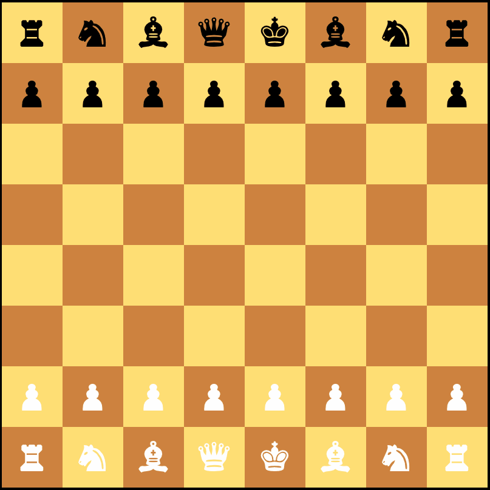

# Jeu d'échec

## Sujet

Dans ce projet, vous allez coder un jeu d'échec. Si vous ne connaissez pas les règles [voici un petit tuto](https://www.chess.com/learn-how-to-play-chess). Notez que nous n'allons pas implémenter certaines règles un peu trop compliquées, vous trouverez [plus bas](#features-à-implémenter) le détail de ce que vous devez implémenter.

De plus, il y aura quelques règles supplémentaires dans notre jeu d'échecs : des évènements aléatoires viendront perturber la partie. Je vous renvoie au sujet de maths que vous donnera Mr. Martinez pour plus d'infos sur ces évènements aléatoires que vous devrez implémenter.

## Infos

- Ce projet sera commun avec les cours de Synthèse d'Image et de Mathématiques. Les profs des matières respectives vous donneront leurs parties du sujet.
- Ce projet se fera par groupes de 2 (et exceptionnellement il peut y avoir un groupe de 3 ou de 1)
- Pour ce cours de C++ j'évaluerai l'entièreté du code du projet, y compris celui de synthèse d'image et de maths. De plus, je n'évalue pas uniquement le nombre de features implémentées, mais aussi (et surtout) la qualité / clarté du code, et le respect des conseils que je vous donnerai dans les différents points de cours tout au long du semestre.

## Deadline

Le projet sera à rendre jeudi 10 avril à 23h59, la veille de la soutenance.

## Pour bien démarrer

Je vous recommande très fortement de partir de [ce template de projet](https://github.com/JulesFouchy/imgui-template). Il inclut déjà la librairie *Dear ImGui* dont vous aurez besoin (cf. les consignes ci-après). Il contient aussi des fichiers [*.clang-format*](./lessons/formatting-tool.md) et [*.clang-tidy*](./lessons/static-analysers.md) (que vous pouvez modifier si vous le souhaitez).

## Consignes

Le jeu se jouera via une GUI codée avec la librairie *Dear ImGui*. Cette librairie vous permettra facilement de placer des boutons à l'écran, qui représenteront les cases du plateau, et sur lesquels on pourra cliquer pour sélectionner les pièces et les déplacer. 
Vous trouverez dans le template de projet que je vous ai fourni quelques exemples sur l'utilisation de la librairie.

Puis vous ferez une visualisation en 3D du plateau et des pièces (cf. le sujet de synthèse d'image), mais même après ça vous garderez la GUI pour jouer les mouvements des pièces, et le monde 3D reflétera les changements. (En bonus, vous pouvez faire du picking en 3D pour cliquer directement dans le monde 3D pour sélectionner les pièces, mais c'est du bonus)

### Features à implémenter

- [ ] Les pièces sont représentées par un bouton de leur couleur (blanc ou noir), avec une lettre les représentant (P pour Pion, etc.)
- [ ] Les cases vides sont soit claires soit sombres, en fonction d'un pattern d'échiquier. La case en bas à gauche est une case sombre.
- [ ] Le plateau commence avec les pièces disposées ainsi, les blancs toujours en bas :

- [ ] Chaque joueur joue tour à tour. On ne peut pas déplacer deux pièces d'une même couleur d'affilée.
- [ ] Ce sont toujours les blancs qui commencent la partie
- [ ] Quand on clique sur une pièce elle devient sélectionnée, puis quand on clique sur une case la pièce sélectionnée se déplace sur cette case (si le coup est valide). On peut désélectionner la pièce avec un clic-droit (`if (ImGui::IsMouseClicked( ImGuiMouseButton_Right ))`).
- [ ] Quand une pièce est sélectionnée, indiquer toutes les cases sur lesquelles elle peut se déplacer
- [ ] Victoire quand on mange le roi adverse (la détection automatique des échecs, et échec et mat, **n'est pas demandée**)
- [ ] La tour se déplace en ligne droite, d'autant de cases qu'elle veut tant qu'elle n'est pas bloquée par une autre pièce
- [ ] Le fou se déplace en diagonale, d'autant de cases qu'il veut tant qu'il n'est pas bloqué par une autre pièce
- [ ] Le cavalier se déplace en L
- [ ] La dame peut se déplacer dans toutes les directions (ligne droite ou diagonale), tant qu'elle n'est pas bloquée par une autre pièce
- [ ] Le roi peut se déplacer d'une case dans toutes les directions
- [ ] Le pion peut avancer d'une case, et peut manger les pièces qui sont une case en diagonale devant lui
- [ ] Si il n'a pas encore bougé, un pion peut avancer de deux cases d'un coup
- [ ] Quand un pion arrive sur la dernière ligne du plateau, il est transformé en une autre pièce (c'est le joueur qui choisit : une dame, une tour, un fou ou un cavalier). Pour que le joueur choisisse, vous pouvez par exemple faire apparaître une fenêtre modale avec ImGui.
- [ ] "En passant": si un pion avance de deux cases, et arrive à côté d'un pion adverse, le pion adverse peut manger le pion en avançant derrière lui. NB: ce doit être fait le tour immédiatement après le déplacement du pion, si l'adversaire décide de jouer autre chose, il ne peut pas manger "en passant" plus tard.

### Règles que vous n'avez pas besoin d'implémenter

- ~~Roquer~~
- ~~Les diverses conditions qui causent un match nul~~
- ~~Victoire quand on met le roi adverse échec et mat~~
- ~~Quand le roi est en échec, les seuls coups autorisés sont des coups qui font que le roi n'est plus en échec~~

## Pour aller plus loin

Voici des consignes optionnelles que vous pouvez suivre afin d'étoffer votre projet. (Vous pouvez aussi rajouter vos propres idées). Ceci dit, avant de vous lancer dans ces nouvelles fonctionnalités, n'oubliez pas que **le plus important dans l'évaluation reste la qualité du code**, donc ne commencez pas à rajouter des choses si vous n'êtes pas confiant.es que ce que vous avez déjà est solide.

- Coder de nouvelles pièces, avec de nouveaux patterns de déplacement
- Quand on déplace une pièce, au lieu qu'elle se téléporte instantanément à sa nouvelle position, faire une animation où elle se déplace progressivement vers sa nouvelle position (dans le monde 3D)
- Pouvoir sauvegarder et charger des parties, avec [la notation FEN](https://www.chess.com/terms/fen-chess)
- Pouvoir choisir la taille du plateau (par exemple jouer sur un 6x6 ou un 13x13)
- Avoir un historique de tous les coups joués et pouvoir revenir en arrière
- Implémenter [les règles qui n'étaient pas demandées](#règles-que-vous-navez-pas-besoin-dimplémenter)
- Coder une IA